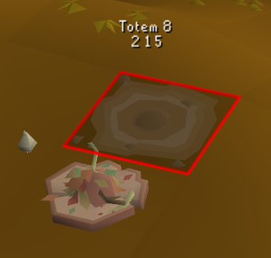
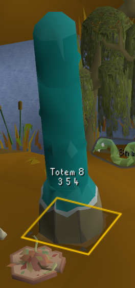
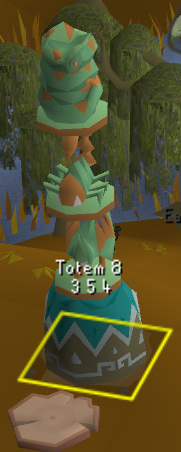
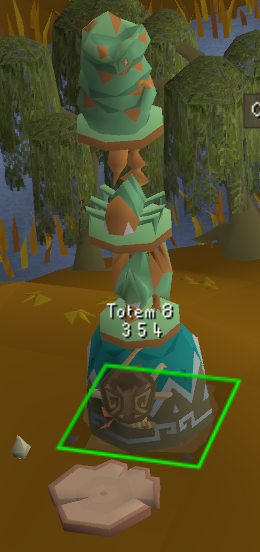
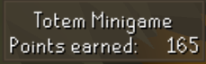
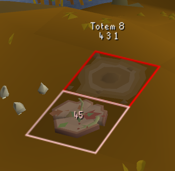

# Totem Minigame
A helper plugin for the Totem minigame in Varlamore

## Features
### Totem Visual Overlays
- Color-coded totem tiles indicating totem status:
  - 🔴 Red: No base placed
  
  - 🟠 Orange: Base placed but not carved
  
  - 🟡 Yellow: Base carved but not fully decorated
  
  - 🟢 Green: Fully decorated totem
  
- Customizable totem text display showing:
  - Animal names only
  - Animal numbers only (for keypad input)
  - Both animal names and numbers
  - Option to hide text completely
- Tracks totem state across all 8 totem sites

### Points & Offerings System

- Live points counter panel showing total offerings collected during the session
  - TODO: Working on getting points/hour tracking going
- Highlight tile and amount of offerings next to totem

### Ent Features
- Ent highlighting
- Ent trail tile highlighting
  - TODO: Still working on getting detection for when the Ent Trail has been activated

### Customization Options
- Individual overlay toggles enable/disable anything you don't like
- Color customization for most visual elements:
  - Totem tile colors for each state
  - Text colors
  - Spirit highlight colors
  - Ent colors
  - Trail colors
  - Offering highlight colors

